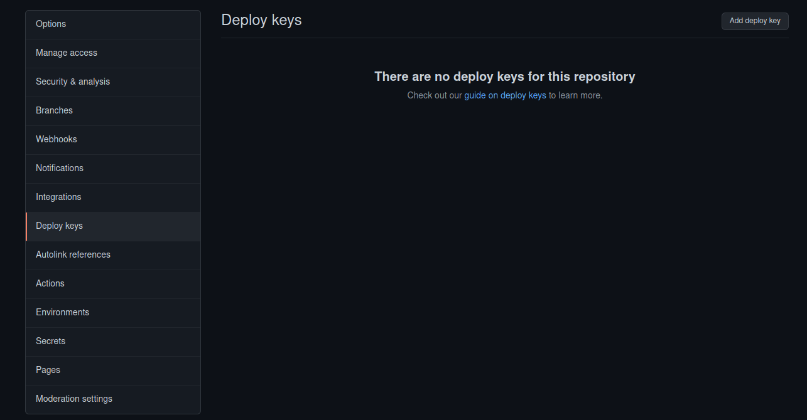

# Deploy

## 1 - deploy key
import your deployment key into git

[](https://raw.githubusercontent.com/theomeunier/dotfile/master/img/docker_policy.png)


## 2 - Git clone projet
```shell
cd /opt/
git clone my_projet
```

## 3 - Add the .env.pro.example in the project and edit

```shell
mv .env.prod.exemple .env
```
Modify the environment variables of the .env

## 4 - Remplacer le docker-compose.prod.yml par docker-compose.yml
```shell
mv docker-compose.prod docker-compose.yml
```

## 5 - Add the nginx conf in the proxy and copy conf
```shell
cd proxy/data/nginx/conf
cp my_projet.conf copy_my_projet.conf
```

## 6 - Edit the conf nginx create
Change all names to the project name

## 7 - restart docker-compose from proxy
```shell
docker-compose restart
```